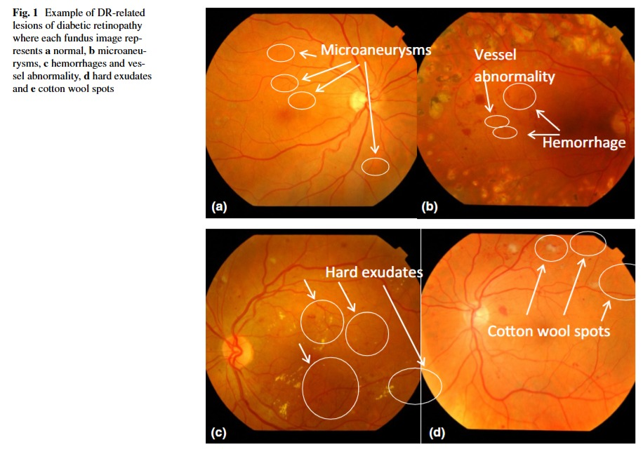

## Problem Statement
Diabetic Retinopathy is a disease with an increasing prevalence and the main cause of blindness among working-age population. The risk of severe vision loss can be significantly reduced by timely diagnosis and treatment. Systematic screening for DR has been identified as a cost-effective way to save health services resources. Automatic retinal image analysis is emerging as an important screening tool for early DR detection, which can reduce the workload associated to manual grading as well as save diagnosis costs and time. Many research efforts in the last years have been devoted to developing automated tools to help in the detection and evaluation of DR lesions. We are interested in automating this predition using deep learning models.

## Dataset used
APTOS 2019 Blindness Dataset from Kaggle

## About Model used
The model is based on ResNet-152, which is a deep CNN, which uses residual learning via skip connections. We have used a custom classifier - a **Linear** layer that maps ResNet's output to 512 features, and a **ReLu** activation, another **Linear** layer to reduce output to 5 classes followed by a **LogSoftMax** layer to produce class probabilities. 

The final classification outputs map to five categories: **'No DR', 'Mild', 'Moderate', 'Severe', 'Proliferative DR'**.

